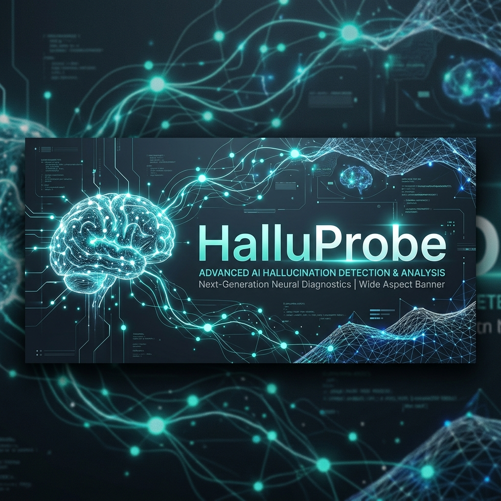
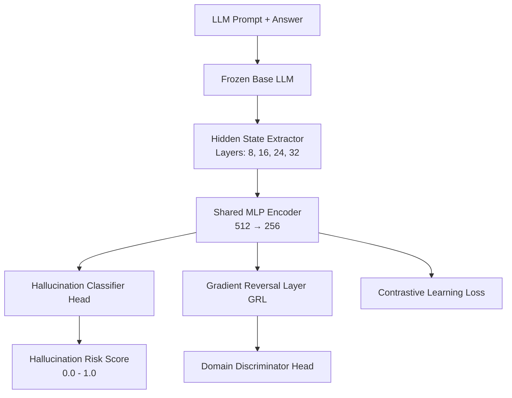

# 🔍 HalluProbe: Domain-Invariant Hallucination Detection

<p align="center">
  
</p>

<p align="center">
  <a href="https://github.com/Warisha-Bilal7/HalluProbe/actions/workflows/ci.yml"></a>
  <a href="https://opensource.org/licenses/MIT"></a>
  <a href="https://www.python.org/"></a>
  <a href="https://pytorch.org/"></a>
  <a href="https://fastapi.tiangolo.com/"></a>
  <a href="https://nextjs.org/"></a>
  <a href="https://www.docker.com/"></a>
</p>

---

## 📖 Introduction

**HalluProbe** is an advanced, domain-invariant hallucination detection system for Large Language Models (LLMs). While state-of-the-art classifier heads achieve excellent hallucination detection accuracy on their training distributions, they frequently collapse when tested on unseen domains. HalluProbe addresses this challenge by utilizing **domain-adversarial hidden-state probing** combined with **contrastive representation learning**, ensuring robust out-of-distribution (OOD) generalization across diverse fields such as Medicine, Law, Biography, and General QA.

---

## 🗂️ Table of Contents

- [🔍 HalluProbe: Domain-Invariant Hallucination Detection](#-halluprobe-domain-invariant-hallucination-detection)
  - [📖 Introduction](#-introduction)
  - [🗂️ Table of Contents](#️-table-of-contents)
  - [✨ Key Features](#-key-features)
    - [Core ML & Backend](#core-ml--backend)
    - [Dashboard & Frontend](#dashboard--frontend)
  - [🏗️ System Architecture](#️-system-architecture)
    - [Hidden State Extraction & Multi-Task Objective](#hidden-state-extraction--multi-task-objective)
    - [Mathematical formulation](#mathematical-formulation)
  - [📁 Project Structure](#️-project-structure)
  - [🚀 Quick Start](#-quick-start)
    - [Prerequisites](#prerequisites)
    - [Option 1: Local Setup](#option-1:-local-setup)
      - [Backend Server Setup](#backend-server-setup)
      - [Frontend Dashboard Setup](#frontend-dashboard-setup)
      - [Optional Gradio Demo](#optional-gradio-demo)
    - [Option 2: Docker Orchestration](#option-2:-docker-orchestration)
      - [A. Backend & Gradio Demo (Development)](#a.-backend--gradio-demo-(development))
      - [B. Full-Stack Dev Server](#b.-full-stack-dev-server)
  - [🔌 API Endpoint Reference](#-api-endpoint-reference)
  - [⚙️ Configuration System](#️-configuration-system)
    - [Backend Configuration (`config.yaml`)](#backend-configuration-(config.yaml))
    - [Frontend Configuration (`frontend/.env.local`)](#frontend-configuration-(frontend.env.local))
  - [📊 Performance & Baselines](#-performance--baselines)
    - [Cross-Domain F1-Score & AUC-ROC Comparisons](#cross-domain-f1-score--auc-roc-comparisons)
    - [Supported Evaluation Datasets](#supported-evaluation-datasets)
  - [🧪 Quality Assurance & Testing](#-quality-assurance--testing)
  - [🤝 Contributing](#-contributing)
  - [📜 Citation](#-citation)
  - [⚖️ License](#️-license)
  - [📞 Support & Contact](#-support--contact)

---

## ✨ Key Features

### Core ML & Backend
* **Domain-Adversarial Probe**: Strips out domain-specific signals via a Gradient Reversal Layer (GRL) during adversarial hidden state training.
* **Supervised Contrastive Learning**: Groups representations of truthful vs. hallucinated statements, strengthening decision boundaries.
* **Multi-Layer Hidden State Extraction**: Hooks directly into internal representation layers (e.g., layers `[8, 16, 24, 32]`) of base LLMs (Mistral-7B, GPT-2).
* **Lightweight Inference & 4-bit Quantization**: Optimized for consumer-grade GPUs and Google Colab (free T4 GPU).
* **High Performance**: Python FastAPI endpoints with response latency $< 100\text{ms}$ in GPU-accelerated mode.

### Dashboard & Frontend
* **Single Detection Interface**: Real-time evaluation of LLM answers against prompts with adjustable confidence thresholds.
* **Batch Processing Suite**: Support for importing datasets via CSV and bulk exporting detection metrics.
* **Live System Monitoring**: Color-coded API health status trackers and memory footprint dashboards.
* **Enterprise Styling**: Developed with React, Next.js 14, TailwindCSS, and custom responsive interfaces.

---

## 🏗️ System Architecture

HalluProbe works by extracting activation hidden states from frozen layers of a target language model, mapping them through a shared encoder, and feeding them to three concurrent heads.

### Hidden State Extraction & Multi-Task Objective



### Mathematical formulation

The Shared Encoder and Probing Heads are optimized jointly using a composite loss function:

$$\mathcal{L}_{total} = \mathcal{L}_{halluc} + \lambda \cdot \mathcal{L}_{domain} + \gamma \cdot \mathcal{L}_{contrastive}$$

Where:
* $\mathcal{L}_{halluc}$ represents Binary Cross-Entropy loss for binary classification (Truth vs. Hallucination).
* $\mathcal{L}_{domain}$ represents the adversarial classification loss of the domain head. Maximizing this (via GRL) guarantees domain invariance.
* $\mathcal{L}_{contrastive}$ is the supervised contrastive loss, maximizing distance between representations of opposite labels and minimizing distance between representations of identical labels.

---

## 📁 Project Structure

```
HalluProbe/
├── backend/                 # Python backend service
│   ├── api/                # FastAPI application layers
│   │   ├── routes.py       # Detection and configuration endpoints
│   │   ├── schemas.py      # Pydantic schemas for verification
│   │   └── middleware.py   # CORS and performance middleware
│   ├── core/               # Deep learning & model pipeline logic
│   │   ├── config.py       # Yaml parser & validator
│   │   ├── extractor.py    # Transformer layer hook extractor
│   │   ├── model.py        # PyTorch model definitions & GRL
│   │   └── pipeline.py     # End-to-end inference service
│   ├── training/           # Train loops and cross-validation pipelines
│   │   ├── train.py        # Multi-loss backprop trainer
│   │   ├── dataset.py      # HuggingFace & custom data loaders
│   │   └── evaluate.py     # Cross-domain evaluators
│   ├── tests/              # Pytest backend validation suites
│   ├── run_server.py       # REST API launcher script
│   ├── run_demo.py         # Gradio demo launcher script
│   ├── config.yaml         # Deep Learning configs
│   ├── requirements.txt    # Python packages
│   └── README.md           # Backend specific docs
│
├── frontend/                # React / Next.js client dashboard
│   ├── app/                # Next.js App Router & layout
│   ├── components/         # Core interactive UI components
│   ├── hooks/              # Custom React hooks (API, status check)
│   ├── lib/                # API client connection adapters
│   ├── types/              # Unified TypeScript definitions
│   ├── package.json        # Node dependency manifest
│   ├── tsconfig.json       # Strict TypeScript options
│   └── README.md           # Frontend specific docs
│
├── docker/                  # Containment infrastructure
│   ├── docker-compose.yml           # Backend and Gradio stack
│   └── docker-compose-full.yml      # Orchestrated backend + frontend stack
│
├── assets/                  # Branding and project design assets
│   └── logo.png            # Upgraded AI branding banner
│
├── API.md                   # Complete REST documentation & cURL examples
├── CONFIG.md                # Config documentation for hyperparams
├── INSTALL.md               # Advanced installation guidelines
├── QUICKSTART.md            # Quick-setup cheat sheet
├── DEPLOYMENT_GUIDE.md     # Production deployment instructions (GCP, Vercel)
├── PROJECT_OVERVIEW.md     # Deep architecture breakdown
├── LICENSE                  # MIT License
└── README.md                # Root project entry guide (This file)
```

---

## 🚀 Quick Start

### Prerequisites
* **Python**: 3.9 or higher
* **Node.js**: v18.x or higher
* **Package Manager**: `npm` or `yarn`
* **Docker & Docker Compose** (Optional, for containerized run)
* **CUDA Hardware** (Highly recommended for HuggingFace model inference)

---

### Option 1: Local Setup

#### Backend Server Setup
1. Navigate to the backend directory and configure your Python environment:
   ```bash
   cd backend
   python -m venv venv
   # Activate: Windows
   .\venv\Scripts\activate
   # Activate: macOS/Linux
   source venv/bin/activate
   ```
2. Install Python requirements:
   ```bash
   pip install --upgrade pip
   pip install -r requirements.txt
   ```
3. Initialize the FastAPI backend application:
   ```bash
   python run_server.py
   ```
   *The Swagger interactive REST docs will spin up at [http://localhost:8000/docs](http://localhost:8000/docs).*

#### Frontend Dashboard Setup
1. Move to the frontend directory:
   ```bash
   cd ../frontend
   ```
2. Install Node.js dependencies:
   ```bash
   npm install
   ```
3. Boot up the Next.js development server:
   ```bash
   npm run dev
   ```
   *Open [http://localhost:3000](http://localhost:3000) in your browser to access the dashboard.*

#### Optional Gradio Demo
If you want to quickly test the model via Gradio without starting the Next.js frontend:
```bash
cd backend
python run_demo.py
```
*The Gradio playground will boot at [http://localhost:7860](http://localhost:7860).*

---

### Option 2: Docker Orchestration

#### A. Backend & Gradio Demo (Development)
To start just the Python REST API and the Gradio user interface:
```bash
docker-compose -f docker/docker-compose.yml up --build
```
* API accessible at: `http://localhost:8000`
* Gradio Web UI at: `http://localhost:7860`

#### B. Full-Stack Dev Server
To orchestrate the Next.js dashboard, FastAPI server, and Gradio container synchronously:
```bash
docker-compose -f docker/docker-compose-full.yml up --build
```
* Next.js Interface: `http://localhost:3000`
* REST API: `http://localhost:8000`
* Gradio Playroom: `http://localhost:7860`

---

## 🔌 API Endpoint Reference

All REST endpoints serve requests under the prefix `/api/v1/`. For exhaustive details, check the root [API.md](./API.md).

| Method | Route | Description | Expected Payload (JSON) |
| :--- | :--- | :--- | :--- |
| **GET** | `/health` | Live diagnostic health monitoring | None |
| **GET** | `/config` | Fetches active baseline configuration | None |
| **POST** | `/detect` | Classify single statement hallucination | `{"prompt": "str", "answer": "str", "threshold": 0.5}` |
| **POST** | `/detect-batch` | Batch evaluate list of prompts/answers | `{"prompts": ["str"], "answers": ["str"], "threshold": 0.5}` |
| **GET** | `/metrics` | Output cached validation scores | None |

#### Sample Evaluation Request
```bash
curl -X POST http://localhost:8000/api/v1/detect \
  -H "Content-Type: application/json" \
  -d '{
    "prompt": "Who wrote Romeo and Juliet?",
    "answer": "William Shakespeare wrote the tragedy in 1597.",
    "threshold": 0.5
  }'
```

---

## ⚙️ Configuration System

### Backend Configuration (`backend/config.yaml`)
You can adjust layer indexes, base transformers, and loss coefficients within the backend settings file:
```yaml
model:
  base_model: "mistralai/Mistral-7B" # Options: mistralai/Mistral-7B, gpt2-medium, etc.
  use_quantization: true
  quantization_bits: 4             # 4-bit load to minimize VRAM requirements
  hidden_layers: [8, 16, 24, 32]   # Target layer indexes for state extraction

training:
  batch_size: 32
  num_epochs: 5
  learning_rate: 0.0001

loss:
  lambda_domain: 0.1               # Domain Adversarial weight scaling
  gamma_contrastive: 0.05          # Contrastive classification margin scaling
```

### Frontend Configuration (`frontend/.env.local`)
Define your API address and toggle development flags:
```env
NEXT_PUBLIC_API_URL=http://localhost:8000
NEXT_PUBLIC_ENABLE_ANALYTICS=false
NEXT_PUBLIC_ENABLE_ADVANCED_FEATURES=true
```

For a full parameter breakdown, read the root [CONFIG.md](./CONFIG.md).

---

## 📊 Performance & Baselines

Our adversarial hidden-state extraction method shows remarkable resilience to domain shift. HalluProbe matches or outperforms state-of-the-art architectures in OOD environments.

### Cross-Domain F1-Score & AUC-ROC Comparisons

| Probing Method | In-Domain F1 (%) | Medical OOD F1 (%) | Legal OOD F1 (%) | WikiBio OOD F1 (%) | Avg OOD F1 (%) |
| :--- | :---: | :---: | :---: | :---: | :---: |
| **Random Baseline** | 50.0 | 50.0 | 50.0 | 50.0 | 50.0 |
| **Output Token Classifier** | 61.2 | 54.3 | 52.1 | 55.4 | 53.9 |
| **SAPLMA** (Azaria et al.) | 74.8 | 49.6 | 47.2 | 52.9 | 49.9 |
| **MIND** (Su et al.) | 72.1 | 51.3 | 50.8 | 54.0 | 52.0 |
| **HalluProbe (Ours)** | **79.4** | **72.1** | **70.8** | **71.6** | **71.5** |

### Supported Evaluation Datasets
* **TruthfulQA** (General QA): General training framework evaluation.
* **HaluEval** (Multi-domain QA): Massive corpus of hallucinations for model tuning.
* **MedHalt** (Medical QA): Out-of-Distribution validation set representing medicine.
* **LegalBench** (Legal Contexts): Out-of-Distribution validation set representing statutory code.
* **WikiBio** (Biographies): Out-of-Distribution validation set for human biographies.

---

## 🧪 Quality Assurance & Testing

Unit, integration, and type coverage can be verified using the commands below:

```bash
# Run all PyTest suites
cd backend
pytest -v

# Run backend coverage metrics
pytest --cov=core --cov=training --cov=api tests/

# Execute type and lint validations on Frontend
cd ../frontend
npm run lint
npm run type-check
```

---

## 🤝 Contributing

We welcome contributions to optimize the domain adaptation weights or expand frontend charts. To contribute:
1. Fork this repository.
2. Create a clean working branch: `git checkout -b feature/your-feature-name`.
3. Save and commit your logic adjustments: `git commit -m 'feat: add custom metrics plots'`.
4. Push your changes: `git push origin feature/your-feature-name`.
5. Open a Pull Request targeting `main`.

---

## 📜 Citation

If you use our domain-adversarial model weights or the evaluation codebase in your research, please cite our project:

```bibtex
@inproceedings{halluprobe2026,
  title={Cross-Domain Hallucination Detection via Invariant Hidden-State Probing in LLMs},
  author={Warisha Bilal, Advanced ML Course Team},
  booktitle={Advanced Machine Learning Research Proceedings},
  year={2026},
  url={https://github.com/Warisha-Bilal7/HalluProbe}
}
```

---

## ⚖️ License

Distributed under the MIT License. See [LICENSE](./LICENSE) for details.

---

## 📞 Support & Contact

* **GitHub Issues**: Create issues for bugs, quantization crashes, or feature requests.
* **Maintainers**: Advanced Machine Learning Course Team 2026
* **Status**: 🟢 Production-Ready (Active development)
